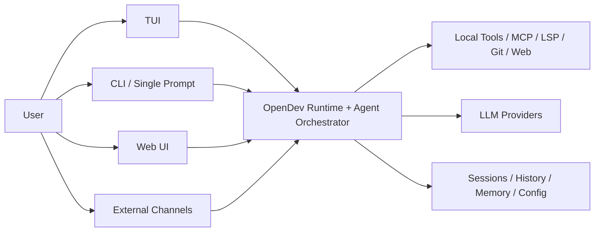
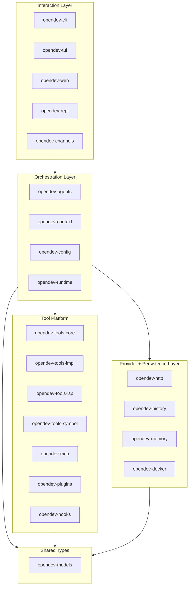
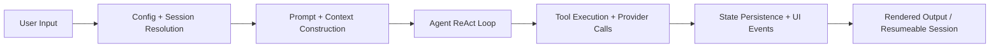
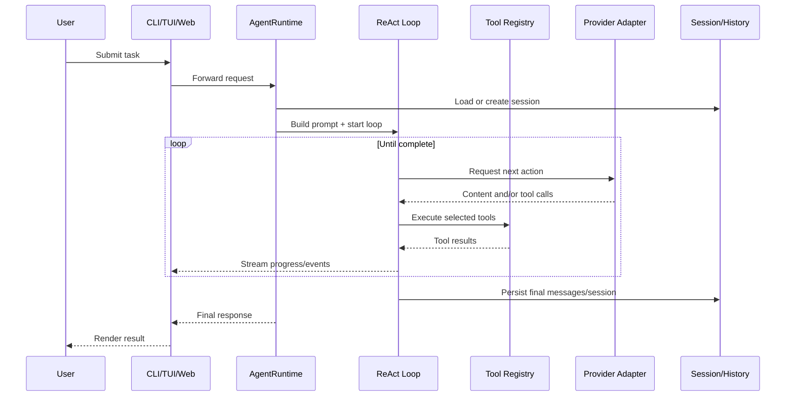
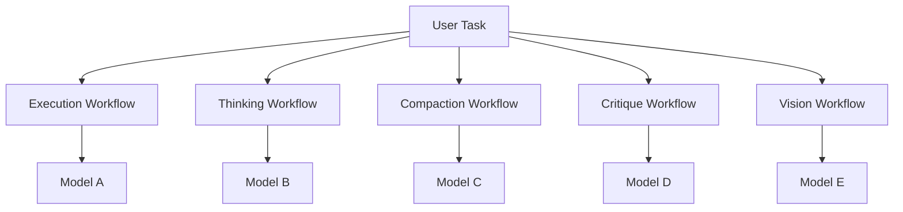
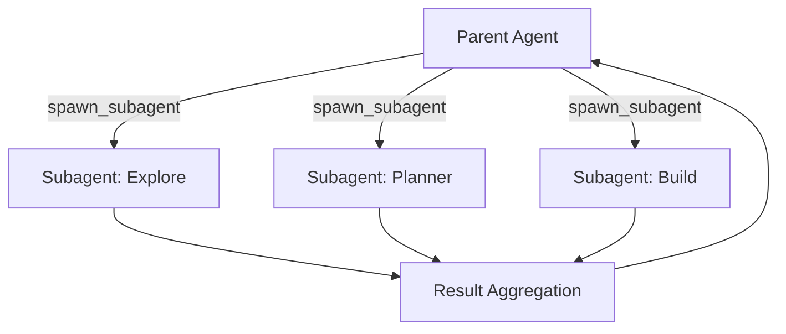
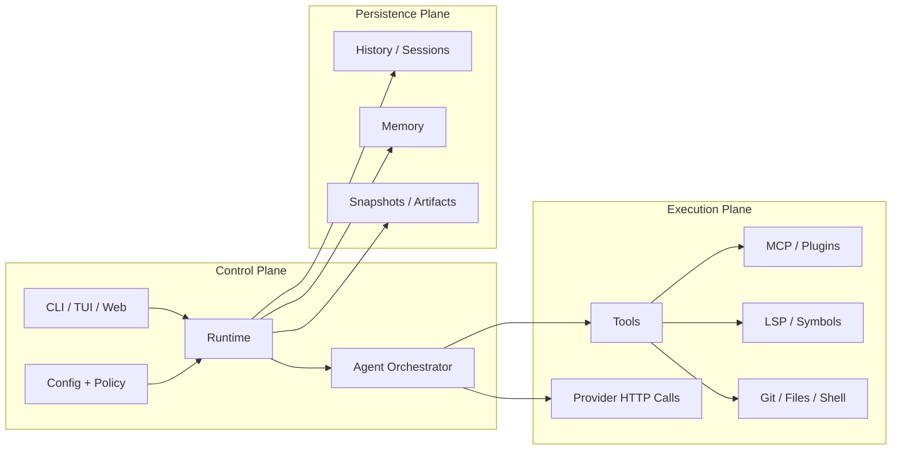

# OpenDev Architecture

This document describes OpenDev as it exists in the current Rust codebase and presents a narrative architecture that is suitable for technical onboarding, design reviews, demos, and rendered documentation.

It is intentionally opinionated in presentation: the goal is not only to list crates, but to explain the system as a compound AI runtime with clear control planes, data planes, and user-facing flows.

Technical report reference:

- arXiv: https://arxiv.org/pdf/2603.05344

## Executive Summary

OpenDev is a compound AI coding agent built as a Rust workspace. It is not a single monolithic chatbot loop. It is a layered system that combines:

- interaction surfaces: CLI, TUI, Web UI, REPL, channel adapters
- a runtime core: config, approval, sessions, history, interruption, cost tracking
- an agent orchestration layer: prompt composition, ReAct loop, subagents, skills, compaction
- a tool platform: local tools, web tools, git/file tools, MCP tools, LSP/symbol tools
- a provider abstraction: multi-provider, multi-model HTTP adapters
- persistence and context systems: history, memory, snapshots, artifact indexes

The result is a system where the user sees "one assistant", but internally OpenDev behaves more like an operating environment for cooperating agent workflows.

## Design Thesis

The architecture can be understood through four ideas:

1. OpenDev is a runtime, not just a prompt wrapper.
2. OpenDev is compound AI, not single-model AI.
3. OpenDev treats tools as first-class execution primitives.
4. OpenDev separates user interaction, agent reasoning, and infrastructure concerns into distinct crates.

## System Context

At the outermost layer, OpenDev sits between users, models, tools, and persistent state.

This view is the easiest way to explain OpenDev to non-implementers:

- users interact through multiple frontends
- OpenDev orchestrates reasoning and tool execution
- model providers supply intelligence
- tools supply action
- state systems make sessions resumable and durable

## Workspace Architecture

The Rust workspace is already fairly well-factored. A useful way to present it is as five layers.

### Layer Responsibilities

#### Interaction Layer

This is where sessions enter the system.

- `opendev-cli`: binary entry point, argument parsing, dispatch
- `opendev-tui`: terminal-native interactive interface
- `opendev-web`: Axum backend and WebSocket event broadcasting
- `opendev-repl`: REPL loop, slash commands, prompt preprocessing
- `opendev-channels`: route inbound/outbound messages for external channels

#### Orchestration Layer

This is the control center.

- `opendev-agents`: ReAct loop, prompt composition, subagents, skills
- `opendev-context`: context engineering, instruction discovery, compaction helpers
- `opendev-config`: hierarchical config loading, validation, migration
- `opendev-runtime`: approvals, interruptions, cost tracking, todo lifecycle, events

#### Tool Platform

This is the action system.

- `opendev-tools-core`: registry and tool contracts
- `opendev-tools-impl`: concrete tool implementations
- `opendev-tools-lsp`: language-server-backed capabilities
- `opendev-tools-symbol`: AST and symbol navigation
- `opendev-mcp`: external tool protocol integration
- `opendev-plugins`: plugin system
- `opendev-hooks`: lifecycle automation hooks

#### Provider + Persistence Layer

This is where external and durable state is handled.

- `opendev-http`: provider adapters and API calls
- `opendev-history`: session persistence and snapshotting
- `opendev-memory`: memory and embedding-backed systems
- `opendev-docker`: runtime isolation for Docker-backed execution paths

#### Shared Types

- `opendev-models`: config, session, message, and cross-crate model types

## Architectural Character

OpenDev is best described as three overlapping architectures at once:

- a product architecture: CLI/TUI/Web surfaces
- an agent architecture: model calls, reasoning loops, subagents, compaction
- a systems architecture: registries, event buses, approvals, state persistence

This is important because many AI tools stop at the second layer. OpenDev does not. It treats the agent as part of a broader runtime system.

## Core Runtime Narrative

The easiest way to explain the system internally is as a request moving through six stages.

### 1. User Input

A request can begin in:

- CLI single-prompt mode
- interactive TUI
- Web UI
- REPL
- an external channel routed into the system

### 2. Config and Session Resolution

Before any model call happens, OpenDev establishes:

- working directory
- project instructions
- global and project config
- session identity
- active model bindings
- approval and autonomy mode

This is a major reason the system behaves consistently across entry points.

### 3. Prompt and Context Construction

The prompt is not a static string. It is assembled from:

- system templates
- reminders and directives
- project instruction files such as `AGENTS.md`
- tool descriptions and schemas
- conversation history
- optionally compacted or summarized context

This is where OpenDev behaves like a context engineering system rather than a plain chatbot wrapper.

### 4. Agent ReAct Loop

The core execution engine is the ReAct loop:

- think
- select tools
- run tools
- observe results
- continue or finish

This loop is implemented in `opendev-agents` and is where autonomy actually lives.

### 5. Tool Execution and Provider Calls

The agent can:

- call model providers through `opendev-http`
- invoke built-in tools
- call MCP-discovered tools
- use LSP or symbol tooling for code understanding
- spawn subagents for isolated multi-step work

### 6. State Persistence and UI Events

During and after execution, OpenDev:

- streams progress to the TUI or Web UI
- records tool results and messages
- updates session history
- tracks cost and token usage
- persists snapshots for resume and undo workflows

## The User-Facing Flow

The user experience is deceptively simple, but internally it is multi-stage.

## Compound AI View

One of the most important "fancy" ways to describe OpenDev is that it is a compound AI system, not a single-model shell.

That means different workflows can bind to different models:

- execution model
- thinking model
- compact/compaction model
- critique model
- vision model

This is not just a settings convenience. It is an architectural principle: model choice is moved from "global product identity" into "workflow slot identity".

This gives OpenDev a strong story:

- expensive reasoning can be isolated
- cheap summarization can be delegated
- vision can be optional
- providers can be mixed without changing the overall runtime shape

## Subagent Architecture

Subagents are an important part of the system story because they make OpenDev feel less like one long loop and more like a coordinated agent environment.

In the current codebase, subagents are:

- isolated logical child agents
- created through the `spawn_subagent` tool
- executed in-process as async tasks/futures
- constrained by their own prompts, tools, and permissions
- able to run concurrently when emitted in the same tool batch

This is a strong visual because it shows OpenDev as a coordinator of bounded work packets rather than a single sequential brain.

## Runtime Control Planes

Another good way to present the architecture is to distinguish control planes from execution planes.

### Interaction Control Plane

Responsible for:

- receiving user intent
- switching sessions
- rendering progress
- handling interrupts and approvals

Primary crates:

- `opendev-cli`
- `opendev-tui`
- `opendev-web`
- `opendev-channels`

### Agent Control Plane

Responsible for:

- prompt composition
- loop state
- reminders and directives
- subagent orchestration
- skill loading
- context compaction

Primary crates:

- `opendev-agents`
- `opendev-context`
- `opendev-runtime`

### Action Plane

Responsible for:

- executing concrete side effects
- reading and writing files
- calling external programs
- interacting with web/MCP/LSP systems

Primary crates:

- `opendev-tools-core`
- `opendev-tools-impl`
- `opendev-tools-lsp`
- `opendev-tools-symbol`
- `opendev-mcp`

### Provider Plane

Responsible for:

- model-specific request/response handling
- auth rotation
- request shaping
- retries and provider abstraction

Primary crate:

- `opendev-http`

### Persistence Plane

Responsible for:

- sessions
- history
- snapshots
- memory and embeddings
- durable config

Primary crates:

- `opendev-history`
- `opendev-memory`
- `opendev-config`

## Why the Crate Split Works

The current workspace separation is good because it aligns to stable responsibilities:

- UI code is not tightly coupled to provider code.
- tool execution is not embedded directly into the agent loop.
- session/history logic is not buried inside the TUI.
- provider adapters are swappable without changing orchestration semantics.

This gives OpenDev a relatively clean evolutionary path:

- more tools can be added without redesigning the runtime
- more providers can be added without rewriting the loop
- more UIs can be added without changing the agent core

## A Recommended "Fancy" Presentation Narrative

If you need to present OpenDev in a deck, demo, or document, use this sequence:

### Slide 1: Product Identity

OpenDev is a terminal-native, open-source compound AI coding runtime.

### Slide 2: System Context

Show users, frontends, runtime, tools, models, and state.

Use the "System Context" diagram from this document.

### Slide 3: Layered Workspace Architecture

Show the five-layer crate map.

Use the "Workspace Architecture" diagram from this document.

### Slide 4: Runtime Request Flow

Show input -> context -> ReAct -> tools/models -> persistence -> UI response.

Use the "Core Runtime Narrative" or sequence diagram.

### Slide 5: Compound AI Story

Show workflow-slot-specific model binding.

Use the "Compound AI View" diagram.

### Slide 6: Subagent Coordination

Show the parent agent coordinating multiple bounded workers.

Use the "Subagent Architecture" diagram.

### Slide 7: Architectural Differentiation

Explain that OpenDev differs from a typical CLI wrapper because it combines:

- multi-surface UX
- workflow-specific model routing
- first-class tool orchestration
- subagent coordination
- durable session/history systems

## Suggested Figure Set

If you want a polished docs section or whitepaper appendix, this is the recommended figure list:

1. System Context Diagram
2. Layered Workspace/Crate Architecture
3. End-to-End Request Sequence
4. Compound AI Workflow-to-Model Mapping
5. Parent Agent / Subagent Coordination Diagram
6. Control Plane vs Action Plane Diagram

Here is a control-plane figure you can use directly:

## The Cleanest One-Paragraph Description

If you need a concise architecture paragraph for the README, website, or a talk:

> OpenDev is a compound AI coding runtime built as a layered Rust workspace. User requests enter through the CLI, TUI, Web UI, or channel adapters, pass through a shared runtime that resolves config, session state, and approvals, then execute inside a ReAct-based agent orchestrator that can call tools, route work to subagents, and bind different workflows to different LLMs. A modular tool platform provides access to local file/shell/git operations, web and MCP tools, and code intelligence via LSP and symbol systems, while persistence layers handle history, memory, snapshots, and resumable sessions.

## Closing View

The most important thing to communicate is that OpenDev is not merely "a Rust CLI for talking to a model".

It is:

- a multi-surface product
- a compound AI orchestrator
- a tool-execution runtime
- a persistent session system
- a modular workspace designed for extension

That is the architectural story worth highlighting in any figure set or design document.
